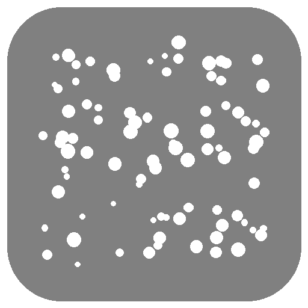

#  White Noise

An ambient noise machine for OVOS - "play white noise" for sleep or
focus. White, pink, and brown noise, **all generated**, not recorded.

[](https://github.com/andlo/ovos-skill-white-noise/actions/workflows/test.yml)
[](https://pypi.org/project/ovos-skill-white-noise/)

## Usage
```
"play white noise"
"play pink noise"
"start some background noise"
"stop the noise"
"spil hvid støj"          (Danish)
"stop støjen"             (Danish)
```

## Why no rain/ocean/fan sounds

The original brief mentioned rain and ocean waves too. Those need
genuinely **loopable recordings** - a hard seam or click at the loop
point would be very noticeable in a sustained ambient track, a
stricter sourcing requirement than the short one-shot clips
[ovos-skill-sound-like](https://github.com/andlo/ovos-skill-sound-like)
uses. White/pink/brown noise sidesteps the problem entirely: noise
has no coherent waveform pattern for the ear to lock onto, so a
generated clip looping back to its own start is inherently seamless.
Rain/ocean are a real future possibility, but need actual recordings
sourced and vetted for clean looping - not built here.

## How the noise is generated

- **White**: uniform random samples (flat spectrum).
- **Pink**: [Paul Kellet's economy IIR filter](https://www.firstpr.com.au/dsp/pink-noise/)
  approximation (1/f spectrum) - a well-known, publicly documented
  DSP technique, not sourced from any particular library or artist.
- **Brown/red**: a clamped random walk (1/f² spectrum).

All three use a fixed random seed, so regenerating a given noise type
produces byte-identical audio - deterministic, same as every other
generated sound in this project family (clicks, tones, drum hits),
even though the underlying content is "random".

## Why "stop" doesn't stop instantly

Same underlying reason as
[ovos-skill-tuning-fork](https://github.com/andlo/ovos-skill-tuning-fork):
`play_audio()` has no reliable way to interrupt an already-playing
sound. Noise loops by repeatedly re-triggering a 20-second generated
clip - "stop" prevents the *next* clip from starting, but the clip
already playing rings out to its natural end. Worst case, that's up
to 20 seconds - noticeably longer than the metronome/rhythm-box's
"before the next beat" stop latency, and disclosed rather than
glossed over.

## Install
```bash
pip install ovos-skill-white-noise
```

## Development

See [DEVELOPMENT.md](DEVELOPMENT.md).

## Category
**Utility**

## Tags
#ambient #sleep #focus #white-noise #relaxation
